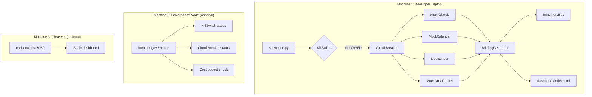

# founder-mode-showcase

[](https://www.python.org/downloads/)
[](LICENSE)
[](https://github.com/hummbl-dev)

**Try the HUMMBL agent mesh in 5 minutes** — zero API keys, zero configuration, zero personal data.

This demo shows how a multi-agent AI governance system works using **mock data** and **real governance primitives**. No GitHub tokens, no Google Calendar OAuth, no Linear API keys. Just `pip install` and `python showcase.py`.

---

## What You'll See

A simulated "Morning Briefing" generated by AI agents — the same pattern that powers the HUMMBL fleet:

```
━━━━━━━━━━━━━━━━━━━━━━━━━━━━━━━━━━━━━━━━
 HUMMBL Morning Briefing — 2026-06-03
━━━━━━━━━━━━━━━━━━━━━━━━━━━━━━━━━━━━━━━━

Health: 3/3 probes passing
GitHub: 3 open PRs, 2 issues need attention
Calendar: 2 meetings today, 1 conflict detected
Linear: 5 tickets in progress, 1 blocked
Cost: $12.40 / $50.00 budget (24%)
Governance: Kill switch DISENGAGED, all circuits CLOSED

Agents active: claude-code, codex, gemini
Top issue: PR #42 — test failure in circuit breaker (assigned: codex)

Generated in 0.03s by founder-mode-showcase v0.1.0
```

---

## Quick Start — 5 Minutes

```bash
# Clone and enter
git clone https://github.com/hummbl-dev/founder-mode-showcase.git
cd founder-mode-showcase

# Option A: uv (recommended — 10-100x faster)
uv venv && source .venv/bin/activate
uv pip install -e .

# Option B: pip (legacy fallback)
python -m venv .venv && source .venv/bin/activate
pip install -e .

# Run the demo
python showcase.py

# View the dashboard
python -m http.server 8080 --directory dashboard/
# Open http://localhost:8080
```

That's it. No env vars. No tokens. No `nodezero`.

---

## What This Demonstrates

| Component | What It Shows | Real-World Equivalent |
|-----------|--------------|----------------------|
| **Mock GitHub Adapter** | Returns synthetic PR/issue data | `github_adapter.py` in founder-mode |
| **Mock Calendar Adapter** | Returns synthetic meetings | `google_calendar_adapter.py` |
| **Mock Linear Adapter** | Returns synthetic tickets | `linear_adapter.py` |
| **Mock Cost Tracker** | Returns synthetic budget data | `cost_tracker.py` |
| **In-Memory Bus** | TSV message bus (single-process) | `founder_mode/bus/` with flock locking |
| **Kill Switch** | `hummbl_governance.KillSwitch` | Emergency halt across all agents |
| **Circuit Breaker** | `hummbl_governance.CircuitBreaker` | Isolate failing adapters |
| **Cost Governor** | `hummbl_governance.CostGovernor` | Budget enforcement |
| **Health Probes** | `hummbl_governance.HealthProbe` | Fleet-wide health monitoring |
| **Briefing Generator** | Combines all adapters into markdown | `founder_mode/services/briefing.py` |

---

## Architecture



**The real HUMMBL fleet** runs this across 3 physical machines (macOS + Windows + macOS) connected via Tailscale, with real adapters hitting real APIs. This demo collapses it all into one process so you can see the pattern without the infrastructure.

---

## The Mesh Pattern

HUMMBL is designed for **multi-machine, multi-agent coordination**:

| Machine | OS | Role | In This Demo |
|---------|-----|------|-------------|
| Developer Laptop | macOS / Linux / Windows+WSL2 | Primary dev, agent orchestration | `showcase.py` runs here |
| Governance Node | any OS, cloud or local | Safety primitives, audit logging | In-process (separable) |
| Observer | any OS, just needs curl | Dashboard, health checks | `python -m http.server` |

**Tested on**: Ubuntu 24.04 LTS · macOS M-series · Windows 11 + WSL2

---

## Governance in Action

The demo uses real `hummbl-governance` primitives:

```python
from hummbl_governance import KillSwitch, KillSwitchMode
from hummbl_governance import CircuitBreaker, CostGovernor, HealthProbe

# Kill switch — 4 graduated halt modes
ks = KillSwitch()
ks.engage(KillSwitchMode.HALT_NONCRITICAL, reason="Cost budget 80% consumed")

# Circuit breaker — isolates failing adapters
breaker = CircuitBreaker(failure_threshold=3, recovery_timeout=30.0)
result = breaker.call(mock_adapter.fetch)

# Cost governor — soft/hard budget caps
gov = CostGovernor(":memory:", soft_cap=50.0, hard_cap=100.0)
gov.record_usage(provider="openai", model="gpt-4", cost=0.02)
status = gov.check_budget_status()  # ALLOW | WARN | DENY

# Health probes — composable health checks
probe = HealthProbe(timeout=5.0)
probe.check("github", lambda: github_adapter.health_check())
```

---

## Files

```
founder-mode-showcase/
  showcase.py              # Main demo script — run this
  pyproject.toml           # Package metadata + deps
  LICENSE                  # Apache 2.0
  README.md                # This file
  dashboard/
    index.html             # Static briefing dashboard
  src/
    showcase/
      __init__.py
      adapters.py          # Mock adapters (GitHub, Calendar, Linear, Cost)
      bus.py               # In-memory TSV bus
      briefing.py          # Briefing generator
      governance.py        # Governance primitive wiring
```

---

## Docker (Optional)

For container fans:

```bash
docker compose up
# Opens dashboard at http://localhost:8080
```

Docker is a **Tier 2 convenience**, not a requirement. The primary deployment model is native Python.

---

## Ecosystem

| Repo | Purpose | Install |
|------|---------|---------|
| [hummbl-governance](https://github.com/hummbl-dev/hummbl-governance) | 25 governance primitives (kill switch, circuit breaker, cost governor) | `pip install hummbl-governance` |
| [arbiter](https://github.com/hummbl-dev/arbiter) | Agent-aware code quality scoring | `pip install arbiter-score` |
| [base120](https://github.com/hummbl-dev/base120) | 120 mental models for structured reasoning | `pip install base120` |
| [founder-mode](https://github.com/hummbl-dev/founder-mode) *(private)* | Full 138-service production platform | Internal only |

---

## License

Apache 2.0 — see [LICENSE](LICENSE).

Built by [HUMMBL](https://hummbl.io) as a reference deployment for multi-agent AI governance.
